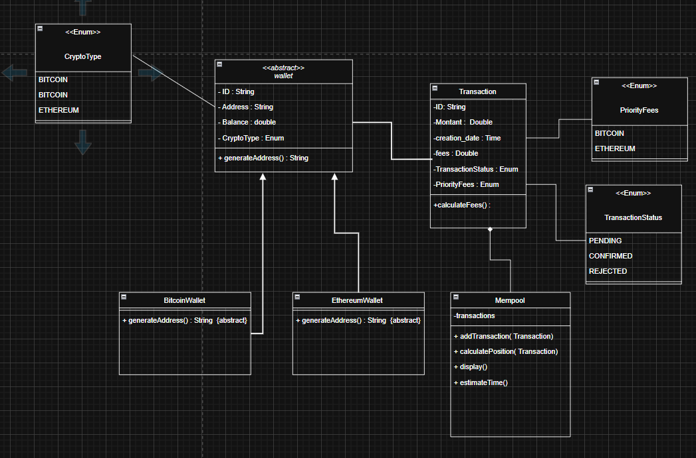
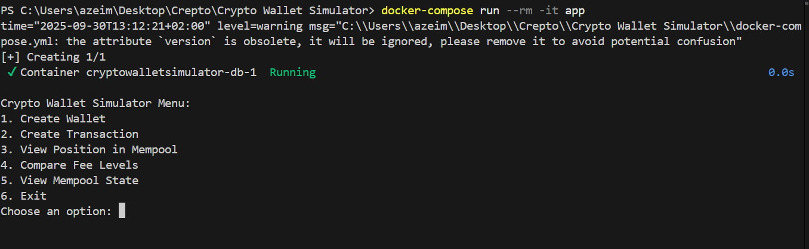
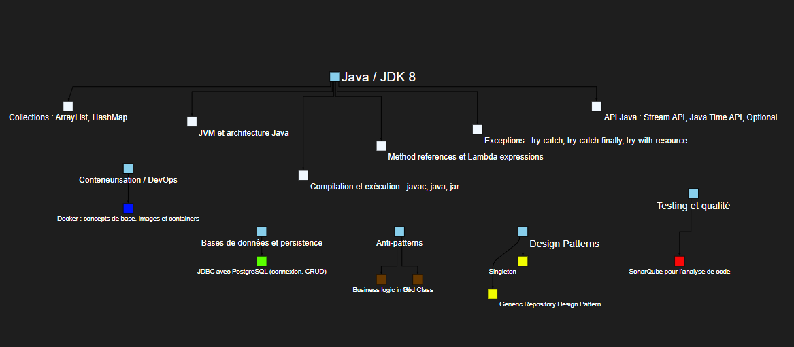

# Crypto Wallet Simulator

This is a console-based Java 8 application that simulates a crypto wallet with a mempool, allowing users to create wallets, manage transactions, and optimize transaction fees.

## Table of Contents
- [Description](#description)
- [Technologies Used](#technologies-used)
- [Project Structure](#project-structure)
- [Prerequisites and Installation](#prerequisites-and-installation)
- [Database Setup](#database-setup)
- [How to Compile and Run](#how-to-compile-and-run)
- [Usage Guide](#usage-guide)
- [UML Diagram](#uml-diagram)

## Description
In the cryptocurrency ecosystem, every transaction requires fees to be validated by the network. These fees vary based on network congestion and desired urgency. This application simulates a crypto wallet with a mempool, helping users understand and optimize their transaction fees for Bitcoin and Ethereum.

Key features include:
- Creating Bitcoin or Ethereum wallets.
- Creating transactions with different fee priorities (Economique, Standard, Rapide).
- Simulating a mempool where transactions are prioritized by fees.
- Calculating a transaction's position in the mempool and estimating confirmation time.
- Comparing the cost and speed trade-offs of different fee levels.
- Viewing the current state of the mempool.

## Technologies Used
- **Java 8**: The core programming language.
- **PostgreSQL**: Relational database for persistent storage of wallets and transactions.
- **JDBC**: Java Database Connectivity for interacting with PostgreSQL.
- **java.util.logging**: For application logging.
- **Java Time API**: For date and time management.


## Prerequisites and Installation
1. Install **Java 8**.
2. Install **PostgreSQL** and create a database.
3. Clone the repository:
```bash
git clone <https://github.com/ABDERRAZZAK-IMILY/Crypto-Wallet-Simulator-.git>
cd crypto-wallet-simulator
```


## Project Structure

```text
src/
├── com/
│ ├── model/ # Wallet and Transaction classes
│ ├── service/ # Business logic
│ ├── repository/ # Database interactions
│ └── main/ # Main application entry point
docker-compose.yml # Docker configuration
```
# sql Script

``` sql

CREATE TABLE IF NOT EXISTS wallets (
    id VARCHAR(255) PRIMARY KEY,
    address VARCHAR(255) NOT NULL UNIQUE,
    balance DOUBLE PRECISION NOT NULL,
    crypto_type VARCHAR(50) NOT NULL
);

CREATE TABLE IF NOT EXISTS transactions (
    id VARCHAR(255) PRIMARY KEY,
    source_address VARCHAR(255) NOT NULL,
    destination_address VARCHAR(255) NOT NULL,
    amount DOUBLE PRECISION NOT NULL,
    fee_priority VARCHAR(50) NOT NULL,
    timestamp TIMESTAMP DEFAULT CURRENT_TIMESTAMP
);
```

# How to Compile and Run

To compile the Java application:
``` bash
javac -d bin src/com/main/Main.java
```

To run the application:
``` bash
java -cp bin com.main.Main
```
# Docker

To run using Docker:
``` bash
docker-compose run --rm -it app
```
# Usage Guide

Launch the application.

Choose to create a Bitcoin or Ethereum wallet.

Create transactions by selecting fee priority.

View the mempool to check transaction order and estimated confirmation times.

Compare different fee levels to optimize transaction speed vs. cost.

# UML Diagram

URL ::  https://app.diagrams.net/?libs=general;uml&src=about#G1YAq6e7_go_8D3sHe-5fSeAXdrS4lX7hN#%7B%22pageId%22%3A%22C5RBs43oDa-KdzZeNtuy%22%7D



# Screnshot




#  schéma récapitulatif 



